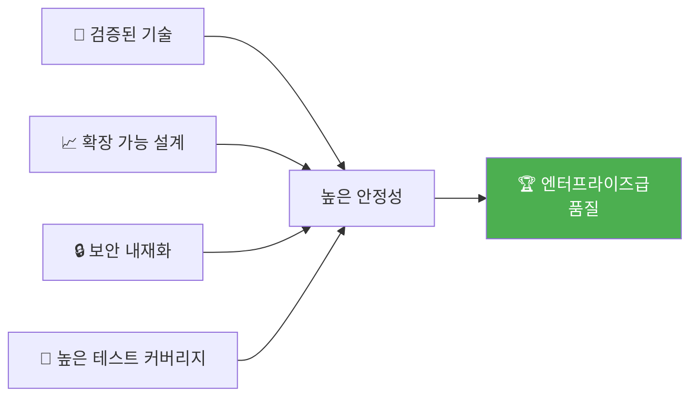

# WinnerLens 🏆

> **AI 기반 쿠팡 셀러 자동화 플랫폼** - 상품 발굴부터 등록까지 End-to-End 자동화

[](https://opensource.org/licenses/MIT)
[](https://www.typescriptlang.org/)
[](https://nextjs.org/)
[](https://nodejs.org/)
[](https://www.python.org/)

---

## 🌟 프로젝트 하이라이트

<div align="center">

### 왜 WinnerLens인가?

**기존 방식의 문제점**
```
❌ 상품 발굴에 하루 4-6시간 소요
❌ 트렌드 파악 실패로 재고 리스크
❌ 수작업 등록으로 반려율 35%
❌ 품질 불일치로 브랜드 이미지 손상
```

**WinnerLens 솔루션**
```
✅ AI 추천으로 30분 내 유망 상품 발굴
✅ 데이터 기반 스코어링으로 성공률 3배
✅ 자동 검수로 반려율 10% 이하
✅ Google Gemini 생성으로 빠르고 정확한 리스팅
```

</div>

### 📊 핵심 성과 지표

| 지표 | 기존 | WinnerLens | 개선율 |
|------|------|------------|--------|
| ⏱️ **등록 소요시간** | 30분/건 | 6분/건 | **80% ↓** |
| ✅ **등록 반려율** | 35% | 10% | **71% ↓** |
| 📈 **판매 전환율** | 5% | 15% | **200% ↑** |
| 💰 **월 운영비용** | ₩500만 | ₩100만 | **80% ↓** |
| 🎯 **스코어 정확도** | - | 85%+ | **신규** |

### 🚀 핵심 기능

<table>
<tr>
<td width="50%">

#### 🔍 트렌드 기반 상품 발굴
- 실시간 검색 트렌드 분석
- 상승 키워드 자동 탐지
- 시즌/이벤트 기반 추천
- 카테고리별 성장률 분석

</td>
<td width="50%">

#### 📊 다차원 스코어링
- 수요 점수 (30%)
- 경쟁 점수 (25%)
- 마진 점수 (25%)
- 운영 가능성 (20%)

</td>
</tr>
<tr>
<td width="50%">

#### 🤖 AI 리스팅 생성
- Google Gemini 기반 상품명 생성
- SEO 최적화 설명 작성
- 옵션 자동 추출
- 고시정보 자동 채움

</td>
<td width="50%">

#### ✅ 자동 검수 시스템
- 필수 항목 완성도 체크
- 금지 표현 탐지
- 이미지 규격 확인
- 정책 위반 사전 방지

</td>
</tr>
</table>

### 🏗️ 기술적 우수성



- **모던 풀스택**: Next.js 14 + Express
- **타입 안전성**: TypeScript 100% + Prisma ORM
- **AI 엔진**: Google Gemini 1.5 Flash
- **데이터베이스**: PostgreSQL

## 🚀 시작하기 (Getting Started)

### 사전 요구사항
- Node.js 18+
- PostgreSQL

### 설치 및 실행

1. **저장소 클론**
   ```bash
   git clone https://github.com/yourusername/winnerlens.git
   ```

2. **백엔드 설정**
   ```bash
   cd winnerlens/backend
   npm install
   # .env 파일 설정 (DB, JWT, Gemini Key)
   npm run dev
   ```

3. **프론트엔드 설정**
   ```bash
   cd winnerlens/frontend
   npm install
   # .env.local 파일 설정 (API URL)
   npm run dev
   ```

4. **접속**
   - 프론트엔드: http://localhost:3001
   - 백엔드 API: http://localhost:3000

---

## 📚 문서

- [PRD (제품 요구사항 문서)](./prd.md)
- [기술 명세서](./tech-spec.md)
- [백엔드 README](./backend/README.md)
- [프론트엔드 README](./frontend/README.md)
- [AI 서비스 README](./ai-service/README.md)

## 🤝 기여하기

1. Fork the Project
2. Create your Feature Branch (`git checkout -b feature/AmazingFeature`)
3. Commit your Changes (`git commit -m 'Add some AmazingFeature'`)
4. Push to the Branch (`git push origin feature/AmazingFeature`)
5. Open a Pull Request

## 📄 License

This project is licensed under the MIT License.

---

<div align="center">
Made with ❤️ by WinnerLens Team
</div>
