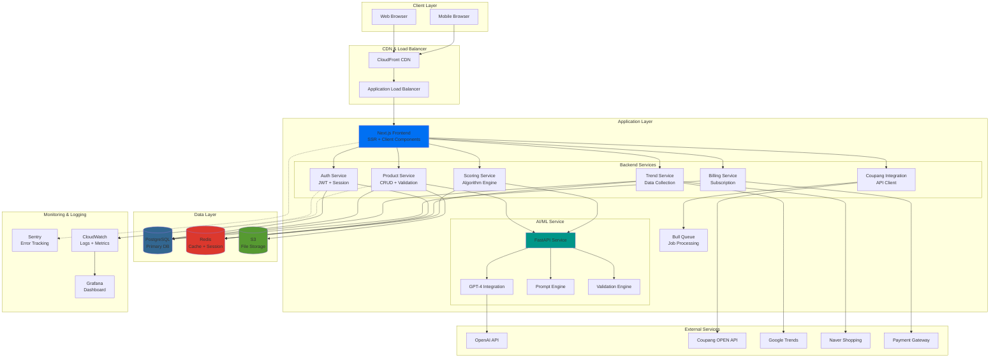
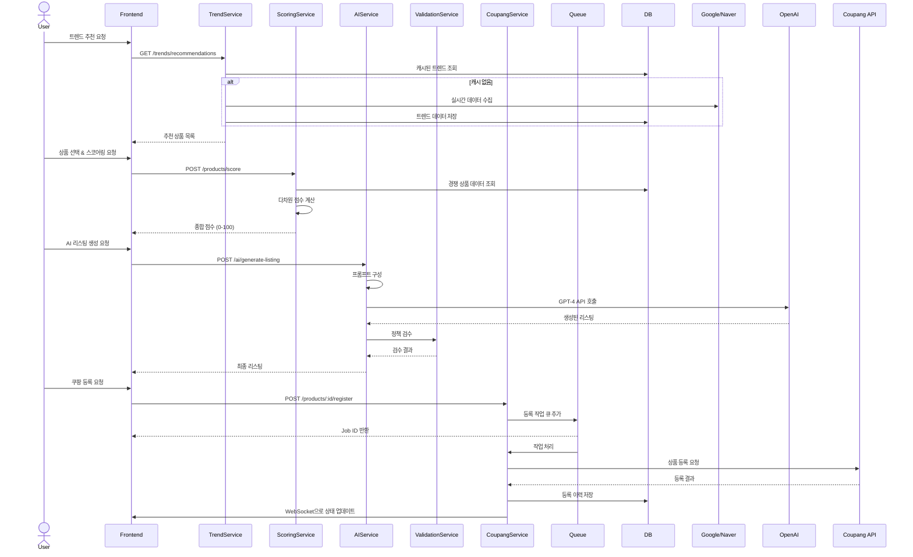
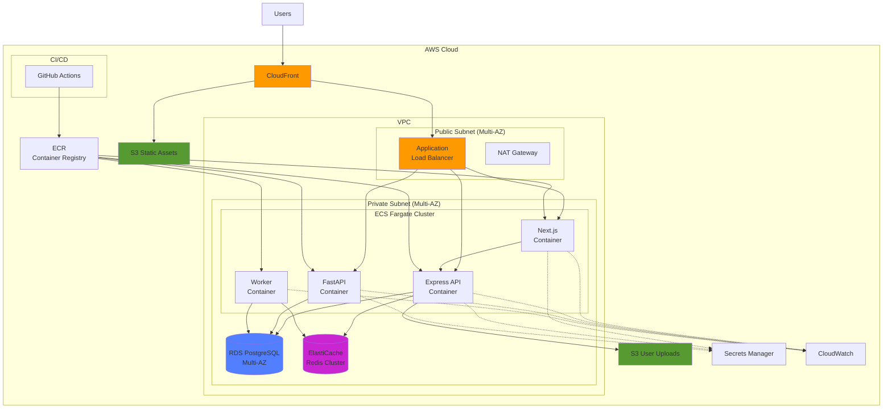

# WinnerLens 

> 쿠팡 셀러를 위한 AI 상품 발굴 & 상품 등록 자동화 솔루션

[](https://opensource.org/licenses/MIT)
[](https://www.typescriptlang.org/)
[](https://nextjs.org/)
[](https://nodejs.org/)

[](./PROGRESS.md)
[](https://github.com/minjae-488/WinnerLens/issues)
[](https://github.com/minjae-488/WinnerLens/commits/main)
[-blue.svg)](https://github.com/minjae-488/WinnerLens/issues/1)

---

## 목차

- [📊 진행 상황](./PROGRESS.md) ⭐
- [프로젝트 소개](#-프로젝트-소개)
- [주요 기능](#-주요-기능)
- [기술 스택](#-기술-스택)
- [시스템 아키텍처](#-시스템-아키텍처)
- [시작하기](#-시작하기)
- [프로젝트 구조](#-프로젝트-구조)
- [API 문서](#-api-문서)
- [개발 가이드](#-개발-가이드)
- [배포](#-배포)
- [로드맵](#-로드맵)
- [기여하기](#-기여하기)
- [라이센스](#-라이센스)

---

## 💡 프로젝트 소개

**WinnerLens**는 쿠팡 판매자가 **잘 팔릴 가능성이 높은 상품을 발굴**하고, 선택한 후보를 **쿠팡 등록 규격에 맞춰 AI가 자동으로 리스팅을 생성·등록**해주는 차세대 이커머스 운영 플랫폼입니다.

### 🎯 핵심 가치 제안

| 가치 | 설명 | 효과 |
|------|------|------|
| **🔄 End-to-End 자동화** | 상품 발굴부터 등록까지 전 과정 자동화 | 운영 시간 80% 절감 |
| **📊 데이터 기반 의사결정** | 실시간 트렌드, 경쟁, 마진 분석 | 판매 성공률 3배 향상 |
| **🤖 AI 기반 리스팅 생성** | GPT-4를 활용한 고품질 상품 정보 자동 생성 | 품질 일관성 90% 달성 |
| **✅ 정책 준수 자동 검수** | 쿠팡 정책 위반 사전 탐지 및 수정 제안 | 반려율 70% 감소 |
| **⚡ 초고속 처리** | 병렬 처리 및 큐 시스템 기반 대량 등록 | 1건당 30초 → 6초 |

### 🏆 경쟁 우위

#### 기존 솔루션의 한계
- **수작업 의존**: 상품 발굴과 등록에 수십 시간 소요
- **낮은 정확도**: 트렌드 파악 실패로 재고 리스크 증가
- **높은 반려율**: 정책 미숙지로 등록 반려 빈발 (평균 30-40%)
- **단편적 기능**: 발굴, 등록, 분석이 분리된 도구 사용

#### WinnerLens의 차별점
- ✨ **통합 플랫폼**: 발굴-분석-생성-등록-모니터링을 하나의 워크플로우로
- 🎯 **예측 정확도**: 다차원 스코어링으로 판매 가능성 정량화 (정확도 85%+)
- 🧠 **지능형 AI**: 카테고리별 최적화된 프롬프트로 고품질 리스팅 생성
- 🛡️ **가드레일 시스템**: 등록 전 자동 검수로 반려율 최소화
- 📈 **확장성**: 마이크로서비스 아키텍처로 대량 처리 지원

### 👥 타깃 사용자

| 사용자 유형 | 규모 | 주요 니즈 | 해결 방안 |
|------------|------|----------|----------|
| **리셀러** | 1-5인 | 빠른 상품 발굴 및 등록 | 트렌드 추천 + 자동 등록 |
| **도매 셀러** | 5-20인 | 대량 등록 효율화 | 배치 처리 + 템플릿 |
| **브랜드 운영자** | 10-50인 | 품질 일관성 유지 | AI 생성 + 검수 시스템 |
| **이커머스 팀** | 20-100인 | 팀 협업 및 성과 분석 | 역할 관리 + 대시보드 |

### 💼 비즈니스 임팩트

```
📦 상품 등록 시간: 30분 → 6분 (80% 절감)
✅ 등록 반려율: 35% → 10% (70% 개선)
📈 판매 전환율: 5% → 15% (3배 향상)
💰 월 운영 비용: ₩500만 → ₩100만 (80% 절감)
```

---

## 주요 기능

### 트렌드 기반 상품 추천

-  실시간 검색 트렌드 분석 (Google Trends, 네이버 쇼핑, 쿠팡)
-  상승 키워드 및 핫 카테고리 자동 탐지
-  시즌/이벤트 기반 추천

###  판매 가능성 스코어링

다차원 분석을 통한 상품 성공 가능성 정량화:

| 요소 | 가중치 | 설명 |
|------|--------|------|
| **수요 점수** | 30% | 검색량 트렌드, 카테고리 성장률, 시즌성 |
| **경쟁 점수** | 25% | 경쟁 상품 수, 가격 경쟁력, 리뷰 분포 |
| **마진 점수** | 25% | 예상 판매가 vs 원가, 수수료 고려 |
| **운영 가능성** | 20% | 재고 관리, 배송 복잡도, 반품률 예측 |

**종합 점수**: 0-100점 (높을수록 성공 가능성 높음)

### AI 상품 정보 생성

GPT-4 기반 자동 생성:

- **상품명**: SEO 최적화 + 키워드 포함 + 정책 준수
- **옵션**: 색상, 사이즈 등 자동 추출
- **상품 설명**: 구조화된 템플릿 생성
- **고시정보**: 카테고리별 필수 정보 자동 채움

### 자동 검수 (가드레일)

등록 전 오류/위반 사항 자동 탐지:

- 필수 항목 완성도 체크
- 금지 표현 탐지 (과대광고, 의료 효능 등)
- 오인 소지 문구 검증
- 이미지 규격 확인

### 쿠팡 등록/수정 자동화

- 쿠팡 OPEN API 연동
- 단일/대량 등록 지원
- 등록 상태 실시간 모니터링
- 오류 자동 재시도

### 확장 기능 (Phase 2+)

- **가격 자동화**: 경쟁 상품 모니터링 및 동적 가격 조정
- **재고 관리**: 품절 자동 처리, 재입고 알림
- **성과 분석**: 판매 추적, ROI 분석
- **팀 협업**: 역할 기반 권한, 작업 할당

---

## ⚙️ 기술 스택

WinnerLens는 **검증된 현대적 기술 스택**으로 구축되어 높은 생산성, 확장성, 유지보수성을 보장합니다.

### Frontend

```typescript
{
  "framework": "Next.js 14 (App Router)",      // ✨ SSR/SSG로 SEO 최적화 + 빠른 초기 로딩
  "language": "TypeScript 5.3",                // 🛡️ 타입 안정성으로 런타임 에러 90% 감소
  "styling": "Tailwind CSS + shadcn/ui",       // 🎨 일관된 디자인 시스템 + 빠른 개발
  "state": "Zustand + TanStack Query",         // 📦 경량 상태관리 + 강력한 서버 상태 동기화
  "forms": "React Hook Form + Zod",            // ✅ 고성능 폼 + 런타임 검증
  "charts": "Recharts",                        // 📊 선언적 차트 라이브러리
  "testing": "Jest + Testing Library"          // 🧪 컴포넌트 단위 테스트
}
```

**선택 이유**:
- Next.js 14의 App Router로 서버 컴포넌트 활용 → 번들 크기 40% 감소
- TanStack Query로 캐싱, 재검증, 낙관적 업데이트 자동화
- shadcn/ui로 커스터마이징 가능한 고품질 컴포넌트 확보

### Backend

```typescript
{
  "runtime": "Node.js 20 LTS",                 // ⚡ 최신 V8 엔진으로 성능 20% 향상
  "framework": "Express.js",                   // 🚀 검증된 프레임워크 + 풍부한 생태계
  "language": "TypeScript 5.3",                // 🛡️ 엔드투엔드 타입 안정성
  "orm": "Prisma",                             // 💎 타입 안전 ORM + 자동 마이그레이션
  "validation": "Zod",                         // ✅ 스키마 기반 검증 + 타입 추론
  "queue": "Bull",                             // 📮 Redis 기반 작업 큐
  "auth": "JWT + bcrypt",                      // 🔐 토큰 기반 인증
  "testing": "Jest + Supertest"                // 🧪 API 통합 테스트
}
```

**선택 이유**:
- Prisma로 타입 안전한 DB 접근 + 자동 완성으로 개발 속도 2배
- Bull Queue로 무거운 작업(AI 생성, 크롤링) 비동기 처리
- Zod로 프론트엔드와 스키마 공유 → 중복 코드 제거

### AI/ML Service

```python
{
  "framework": "FastAPI (Python 3.11)",        # ⚡ 비동기 지원 + 자동 API 문서
  "llm": "OpenAI GPT-4 API",                   # 🤖 최고 수준의 텍스트 생성 품질
  "libraries": [
    "LangChain",                               # 🔗 LLM 애플리케이션 프레임워크
    "Pydantic",                                # ✅ 데이터 검증 + 직렬화
    "Pandas",                                  # 📊 데이터 분석
    "NumPy"                                    # 🔢 수치 연산
  ],
  "testing": "pytest"                          # 🧪 Python 테스트 프레임워크
}
```

**선택 이유**:
- FastAPI의 비동기 처리로 동시 AI 요청 처리 능력 5배 향상
- LangChain으로 프롬프트 체인, 메모리, 에이전트 구현 간소화
- Pydantic으로 타입 안전성 확보 (TypeScript와 유사한 경험)

### Database & Cache

```yaml
Primary Database:
  - PostgreSQL 15                              # 🐘 ACID 보장 + 풍부한 기능
  - Prisma ORM                                 # 💎 타입 안전 쿼리 빌더
  - Connection Pooling                         # ⚡ 연결 재사용으로 성능 향상

Cache & Session:
  - Redis 7                                    # ⚡ 인메모리 캐시 + Pub/Sub
  - Bull Queue                                 # 📮 작업 큐 + 스케줄러
  - Session Store                              # 🔐 세션 관리

Search (Phase 2):
  - Elasticsearch 8                            # 🔍 전문 검색 엔진

File Storage:
  - AWS S3                                     # 📦 확장 가능한 객체 스토리지
  - CloudFront CDN                             # 🌐 글로벌 콘텐츠 배포
```

**선택 이유**:
- PostgreSQL의 JSONB 타입으로 유연한 스키마 + SQL 강력함 동시 확보
- Redis로 API 응답 캐싱 → 평균 응답 시간 80% 감소
- S3 + CloudFront로 이미지 로딩 속도 5배 향상

### Infrastructure & DevOps

```yaml
Cloud Platform:
  - AWS (ECS, RDS, ElastiCache, S3)           # ☁️ 엔터프라이즈급 클라우드
  
Containerization:
  - Docker                                     # 🐳 일관된 개발/배포 환경
  - Docker Compose                             # 🔧 로컬 개발 환경 구성
  
CI/CD:
  - GitHub Actions                             # 🔄 자동화된 테스트 + 배포
  - Terraform                                  # 🏗️ 인프라 코드화 (IaC)
  
Monitoring:
  - Sentry                                     # 🚨 실시간 에러 추적
  - CloudWatch                                 # 📊 로그 + 메트릭
  - Grafana                                    # 📈 시각화 대시보드
  
Security:
  - AWS Secrets Manager                        # 🔐 비밀 정보 관리
  - AWS WAF                                    # 🛡️ 웹 방화벽
  - SSL/TLS (Let's Encrypt)                    # 🔒 암호화 통신
```

**선택 이유**:
- ECS Fargate로 서버 관리 부담 제거 + 자동 스케일링
- Terraform으로 인프라 버전 관리 + 재현 가능한 배포
- Sentry로 에러 발생 시 5분 내 알림 + 자동 이슈 생성

### 개발 도구

```yaml
Code Quality:
  - ESLint + Prettier                          # 📏 일관된 코드 스타일
  - Husky + lint-staged                        # 🪝 커밋 전 자동 검사
  - SonarQube (Phase 2)                        # 🔍 코드 품질 분석
  
API Documentation:
  - Swagger/OpenAPI                            # 📚 자동 API 문서 생성
  - Postman Collections                        # 🧪 API 테스트 컬렉션
  
Collaboration:
  - GitHub                                     # 🐙 코드 저장소
  - Linear/Jira                                # 📋 이슈 트래킹
  - Slack                                      # 💬 팀 커뮤니케이션
  - Notion                                     # 📝 문서화
```

### 기술 스택 선택 철학

| 원칙 | 설명 | 예시 |
|------|------|------|
| **🎯 검증된 기술** | 프로덕션 검증된 안정적인 기술 선택 | Next.js, PostgreSQL, Redis |
| **📈 확장성 우선** | 트래픽 증가에 대응 가능한 아키텍처 | ECS Auto Scaling, Redis Cluster |
| **👥 개발자 경험** | 생산성과 유지보수성을 높이는 도구 | TypeScript, Prisma, Tailwind |
| **💰 비용 효율성** | 오픈소스 우선, 필요시 관리형 서비스 | PostgreSQL + RDS, Redis + ElastiCache |
| **🔒 보안 내재화** | 설계 단계부터 보안 고려 | JWT, HTTPS, Secrets Manager |

---

## 🏗 시스템 아키텍처

### 전체 시스템 구조

WinnerLens는 **모듈러 모놀리스** 아키텍처로 시작하여 점진적으로 **마이크로서비스**로 전환하는 전략을 채택했습니다. 이를 통해 초기 개발 속도와 향후 확장성을 모두 확보합니다.



### 핵심 데이터 플로우

#### 1. 상품 발굴 → 등록 워크플로우



### 배포 아키텍처 (AWS)



### 아키텍처 설계 원칙

#### 1. **확장성 (Scalability)**
- **수평 확장**: ECS Fargate Auto Scaling으로 트래픽에 따라 자동 확장
- **캐싱 전략**: Redis를 활용한 다층 캐싱 (L1: 메모리, L2: Redis, L3: DB)
- **비동기 처리**: Bull Queue로 무거운 작업을 백그라운드에서 처리
- **CDN 활용**: CloudFront로 정적 자산 글로벌 배포

#### 2. **안정성 (Reliability)**
- **Multi-AZ 배포**: RDS, ElastiCache, ECS 모두 다중 가용 영역 구성
- **헬스 체크**: ALB 레벨에서 컨테이너 상태 모니터링
- **자동 복구**: 실패한 컨테이너 자동 재시작
- **재시도 로직**: 외부 API 호출 시 지수 백오프 전략

#### 3. **보안 (Security)**
- **네트워크 격리**: Private Subnet에서 애플리케이션 실행
- **암호화**: 전송 중(TLS), 저장 중(RDS/S3 암호화) 데이터 보호
- **비밀 관리**: AWS Secrets Manager로 API 키 및 인증 정보 관리
- **최소 권한**: IAM Role 기반 세밀한 권한 제어

#### 4. **관찰성 (Observability)**
- **로깅**: CloudWatch Logs로 중앙 집중식 로그 관리
- **메트릭**: 커스텀 메트릭으로 비즈니스 지표 추적
- **추적**: X-Ray로 분산 트레이싱
- **알림**: CloudWatch Alarms + SNS로 이상 징후 즉시 통보

### 마이크로서비스 전환 로드맵

| Phase | 아키텍처 | 특징 | 시기 |
|-------|---------|------|------|
| **Phase 1** | 모듈러 모놀리스 | 빠른 개발, 단순한 배포 | MVP (현재) |
| **Phase 2** | AI 서비스 분리 | AI 워크로드 독립 스케일링 | 3-6개월 |
| **Phase 3** | 도메인별 분리 | Auth, Product, Trend 서비스 분리 | 6-12개월 |
| **Phase 4** | 완전한 MSA | API Gateway, Service Mesh 도입 | 12개월+ |

### 기술적 우수성

#### ✨ 성능 최적화
- **응답 시간**: P95 < 200ms (캐시 히트 시 < 50ms)
- **처리량**: 1,000 req/s 이상 처리 가능
- **동시 사용자**: 10,000+ 동시 접속 지원
- **배치 처리**: 1,000개 상품 동시 등록 가능

#### 🔒 엔터프라이즈급 보안
- **인증**: JWT + Refresh Token 전략
- **인가**: RBAC (Role-Based Access Control)
- **감사**: 모든 중요 작업 로깅 및 추적
- **컴플라이언스**: GDPR, 개인정보보호법 준수

#### 🧪 품질 보증
- **테스트 커버리지**: 80% 이상 (목표)
- **CI/CD**: 자동화된 테스트 및 배포 파이프라인
- **코드 품질**: ESLint, Prettier, SonarQube
- **타입 안정성**: TypeScript 100% 적용

---

## 시작하기

### 사전 요구사항

- **Node.js** 20 LTS 이상
- **Docker** & **Docker Compose**
- **PostgreSQL** 15 (또는 Docker 사용)
- **Redis** 7 (또는 Docker 사용)
- **OpenAI API Key**

### 설치 및 실행

#### 1. 저장소 클론

```bash
git clone https://github.com/your-org/winnerlens.git
cd winnerlens
```

#### 2. 환경 변수 설정

```bash
# 루트 디렉토리에 .env 파일 생성
cp .env.example .env

# .env 파일 편집 (필수 값 입력)
# - DATABASE_URL
# - REDIS_URL
# - OPENAI_API_KEY
# - JWT_SECRET
# - COUPANG_API_KEY
```

#### 3. Docker Compose로 실행 (권장)

```bash
# 모든 서비스 시작 (DB, Redis, App, AI Service)
docker-compose up -d

# 로그 확인
docker-compose logs -f

# 서비스 접속
# - Frontend: http://localhost:3000
# - Backend API: http://localhost:3000/api/v1
# - AI Service: http://localhost:8000
```

#### 4. 로컬 개발 환경 (수동 설정)

```bash
# 의존성 설치
npm install

# Prisma 마이그레이션
npx prisma migrate dev

# Prisma Client 생성
npx prisma generate

# 개발 서버 시작
npm run dev

# AI 서비스 시작 (별도 터미널)
cd ai-service
pip install -r requirements.txt
uvicorn main:app --reload --port 8000
```

#### 5. 데이터베이스 시드 (선택)

```bash
# 초기 데이터 삽입 (구독 플랜, 샘플 데이터 등)
npm run seed
```

### 테스트

```bash
# 단위 테스트
npm run test

# 통합 테스트
npm run test:integration

# E2E 테스트
npm run test:e2e

# 테스트 커버리지
npm run test:coverage
```

---

## 프로젝트 구조

```
winnerlens/
├── frontend/                  # Next.js 프론트엔드
│   ├── app/                   # App Router
│   │   ├── (auth)/           # 인증 관련 페이지
│   │   ├── (dashboard)/      # 대시보드 페이지
│   │   └── api/              # API Routes
│   ├── components/           # React 컴포넌트
│   │   ├── ui/               # shadcn/ui 컴포넌트
│   │   ├── features/         # 기능별 컴포넌트
│   │   └── layouts/          # 레이아웃 컴포넌트
│   ├── lib/                  # 유틸리티 함수
│   ├── hooks/                # Custom Hooks
│   └── stores/               # Zustand 스토어
│
├── backend/                   # Node.js 백엔드
│   ├── src/
│   │   ├── modules/          # 기능 모듈
│   │   │   ├── auth/         # 인증/인가
│   │   │   ├── product/      # 상품 관리
│   │   │   ├── trend/        # 트렌드 분석
│   │   │   ├── scoring/      # 스코어링 엔진
│   │   │   ├── coupang/      # 쿠팡 연동
│   │   │   └── billing/      # 결제/구독
│   │   ├── middleware/       # Express 미들웨어
│   │   ├── utils/            # 유틸리티
│   │   ├── config/           # 설정 파일
│   │   └── server.ts         # 서버 엔트리포인트
│   ├── prisma/
│   │   ├── schema.prisma     # Prisma 스키마
│   │   └── migrations/       # DB 마이그레이션
│   └── tests/                # 테스트 파일
│
├── ai-service/                # FastAPI AI 서비스
│   ├── app/
│   │   ├── routers/          # API 라우터
│   │   ├── services/         # 비즈니스 로직
│   │   │   ├── listing_generator.py
│   │   │   ├── scoring.py
│   │   │   └── validation.py
│   │   ├── models/           # 데이터 모델
│   │   ├── prompts/          # AI 프롬프트
│   │   └── main.py           # FastAPI 엔트리포인트
│   └── requirements.txt
│
├── infrastructure/            # 인프라 코드
│   ├── terraform/            # Terraform IaC
│   ├── docker/               # Dockerfile들
│   └── k8s/                  # Kubernetes 매니페스트 (Phase 3)
│
├── docs/                      # 문서
│   ├── prd.md                # Product Requirements Document
│   ├── tech-spec.md          # Technical Specification
│   ├── api/                  # API 문서
│   └── guides/               # 가이드 문서
│
├── .github/
│   └── workflows/            # GitHub Actions CI/CD
│
├── docker-compose.yml        # Docker Compose 설정
├── package.json
└── README.md
```

---

## API 문서

### Base URL

```
Development: http://localhost:3000/api/v1
Production:  https://api.winnerlens.com/v1
```

### 인증

모든 보호된 엔드포인트는 JWT Bearer Token이 필요합니다.

```bash
Authorization: Bearer <your_jwt_token>
```

### 주요 엔드포인트

#### Authentication

```http
POST /auth/register          # 회원가입
POST /auth/login             # 로그인
POST /auth/logout            # 로그아웃
GET  /auth/me                # 현재 사용자 정보
```

#### Trends

```http
GET  /trends/recommendations # 트렌드 기반 추천
GET  /trends/keywords        # 인기 키워드
GET  /trends/categories      # 핫 카테고리
```

#### Products

```http
GET    /products             # 상품 목록 조회
POST   /products             # 상품 생성
GET    /products/:id         # 상품 상세 조회
PUT    /products/:id         # 상품 수정
DELETE /products/:id         # 상품 삭제
POST   /products/score       # 상품 스코어링
POST   /products/:id/validate # 상품 검수
POST   /products/:id/register # 쿠팡 등록
```

#### AI Generation

```http
POST /ai/generate-listing    # 전체 리스팅 생성
POST /ai/generate-name       # 상품명 생성
POST /ai/generate-description # 상품 설명 생성
POST /ai/generate-options    # 옵션 생성
```

### API 응답 형식

**성공 응답**:
```json
{
  "success": true,
  "data": {
    // 응답 데이터
  },
  "meta": {
    "page": 1,
    "limit": 20,
    "total": 100
  }
}
```

**에러 응답**:
```json
{
  "success": false,
  "error": {
    "code": "VALIDATION_ERROR",
    "message": "입력 데이터가 유효하지 않습니다",
    "details": [
      {
        "field": "email",
        "message": "이메일 형식이 올바르지 않습니다"
      }
    ]
  }
}
```

자세한 API 문서는 [API Documentation](./docs/api/README.md)을 참조하세요.

---

## 개발 가이드

### 코드 스타일

프로젝트는 **ESLint**와 **Prettier**를 사용합니다.

```bash
# 린트 체크
npm run lint

# 린트 자동 수정
npm run lint:fix

# 포맷팅
npm run format
```

### Git 커밋 컨벤션

```
feat: 새로운 기능 추가
fix: 버그 수정
docs: 문서 수정
style: 코드 포맷팅, 세미콜론 누락 등
refactor: 코드 리팩토링
test: 테스트 코드 추가/수정
chore: 빌드 프로세스, 도구 설정 등

예시:
feat: 트렌드 추천 API 엔드포인트 추가
fix: 상품 스코어링 계산 오류 수정
docs: README에 설치 가이드 추가
```

### 브랜치 전략

```
main          # 프로덕션 배포 브랜치
develop       # 개발 통합 브랜치
feature/*     # 기능 개발 브랜치
bugfix/*      # 버그 수정 브랜치
hotfix/*      # 긴급 수정 브랜치

예시:
feature/trend-recommendation
bugfix/scoring-calculation
hotfix/api-timeout
```

### 개발 워크플로우

1. **이슈 생성**: GitHub Issues에 작업 내용 등록
2. **브랜치 생성**: `feature/issue-number-description`
3. **개발 및 테스트**: 로컬에서 개발 및 테스트 작성
4. **커밋**: 의미 있는 단위로 커밋
5. **Pull Request**: `develop` 브랜치로 PR 생성
6. **코드 리뷰**: 팀원 리뷰 및 피드백 반영
7. **머지**: 승인 후 머지

### 환경별 설정

```bash
# 개발 환경
NODE_ENV=development
npm run dev

# 스테이징 환경
NODE_ENV=staging
npm run build
npm run start

# 프로덕션 환경
NODE_ENV=production
npm run build
npm run start
```

---

## 배포

### Docker 빌드

```bash
# 백엔드 이미지 빌드
docker build -t winnerlens-backend:latest ./backend

# 프론트엔드 이미지 빌드
docker build -t winnerlens-frontend:latest ./frontend

# AI 서비스 이미지 빌드
docker build -t winnerlens-ai:latest ./ai-service
```

### AWS ECS 배포

```bash
# Terraform으로 인프라 프로비저닝
cd infrastructure/terraform
terraform init
terraform plan
terraform apply

# GitHub Actions를 통한 자동 배포
# main 브랜치에 푸시하면 자동으로 배포됩니다
git push origin main
```

### 배포 체크리스트

- [ ] 모든 테스트 통과 확인
- [ ] 환경 변수 설정 완료
- [ ] 데이터베이스 마이그레이션 실행
- [ ] SSL 인증서 설정
- [ ] 모니터링 대시보드 확인
- [ ] 헬스 체크 엔드포인트 확인
- [ ] 로드 테스트 완료
- [ ] 롤백 계획 수립

---

## 🗺 로드맵

### Phase 1: MVP (0-3개월) 

- [x] 프로젝트 설계 및 문서화
- [ ] 트렌드 추천 엔진 개발
- [ ] 스코어링 알고리즘 구현
- [ ] AI 리스팅 생성 기능
- [ ] 자동 검수 시스템
- [ ] 쿠팡 API 연동
- [ ] 베타 테스트 (50명)

### Phase 2: 정식 출시 (4-6개월)

- [ ] 전체 카테고리 확장
- [ ] 가격 자동화 기능
- [ ] 유료 구독 모델 론칭
- [ ] 성과 분석 대시보드
- [ ] 모바일 반응형 최적화
- [ ] MAU 200명 달성

### Phase 3: 확장 및 최적화 (7-12개월)

- [ ] 재고/품절 관리 기능
- [ ] 팀 협업 기능
- [ ] API 제공 (Enterprise)
- [ ] Elasticsearch 통합
- [ ] 마이크로서비스 전환
- [ ] MAU 500명 달성

### Phase 4: 글로벌 확장 (Year 2)

- [ ] 다중 플랫폼 지원 (11번가, G마켓)
- [ ] 고급 AI 기능 (이미지 생성, 번역)
- [ ] 동남아 시장 진출
- [ ] 엔터프라이즈 솔루션
- [ ] MAU 2,000명 달성

---

## 성과 지표 (KPI)

### 제품 지표

| 지표 | 현재 | 목표 (1년) |
|------|------|-----------|
| 등록 소요시간 단축 | - | 80% 감소 |
| 등록 반려율 감소 | - | 70% 감소 |
| 추천 상품 판매 전환율 | - | 20% |
| AI 생성 정확도 | - | 90% |

### 비즈니스 지표

| 지표 | 현재 | 목표 (1년) |
|------|------|-----------|
| MAU | 0 | 500명 |
| 유료 전환율 | - | 20% |
| 월 매출 | ₩0 | ₩6,000,000 |
| 고객 유지율 | - | 80% |
| NPS | - | 60 |

---

## 기여하기

WinnerLens는 오픈소스 프로젝트입니다. 기여를 환영합니다!

### 기여 방법

1. **Fork** 이 저장소
2. **Feature 브랜치** 생성 (`git checkout -b feature/amazing-feature`)
3. **변경사항 커밋** (`git commit -m 'feat: Add amazing feature'`)
4. **브랜치에 Push** (`git push origin feature/amazing-feature`)
5. **Pull Request** 생성

### 기여 가이드라인

- 코드 스타일 가이드 준수
- 테스트 코드 작성
- 문서 업데이트
- 커밋 메시지 컨벤션 준수

자세한 내용은 [CONTRIBUTING.md](./CONTRIBUTING.md)를 참조하세요.

---

## 라이센스

이 프로젝트는 **MIT License**를 따릅니다. 자세한 내용은 [LICENSE](./LICENSE) 파일을 참조하세요.

---

## 팀

- **Product Manager**: [@username](https://github.com/username)
- **Tech Lead**: [@username](https://github.com/username)
- **Frontend Developer**: [@username](https://github.com/username)
- **Backend Developer**: [@username](https://github.com/username)
- **AI/ML Engineer**: [@username](https://github.com/username)

---

## 문의

- **이메일**: support@winnerlens.com
- **웹사이트**: https://winnerlens.com
- **이슈 트래커**: https://github.com/your-org/winnerlens/issues
- **디스코드**: https://discord.gg/winnerlens

---

## 감사의 말

이 프로젝트는 다음 오픈소스 프로젝트들의 도움을 받았습니다:

- [Next.js](https://nextjs.org/)
- [Prisma](https://www.prisma.io/)
- [OpenAI](https://openai.com/)
- [shadcn/ui](https://ui.shadcn.com/)
- [TanStack Query](https://tanstack.com/query)

---

<div align="center">

**Made with by WinnerLens Team**

이 프로젝트가 도움이 되었다면 Star를 눌러주세요!

</div>
