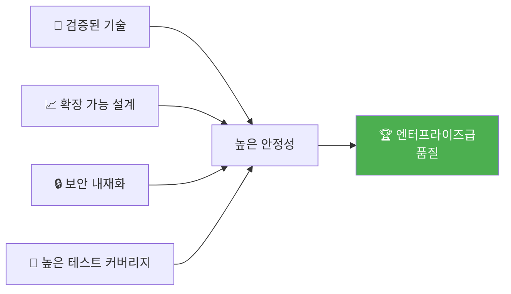

# WinnerLens 🏆

> **AI 기반 쿠팡 셀러 자동화 플랫폼** - 상품 발굴부터 등록까지 End-to-End 자동화

[](https://github.com/minjae-488/WinnerLens/actions/workflows/ci.yml)
[](https://opensource.org/licenses/MIT)
[](https://www.typescriptlang.org/)
[](https://nextjs.org/)
[](https://nodejs.org/)
[](https://www.python.org/)

<div align="center">

### 🚀 [Getting Started](#-시작하기-getting-started) | 📖 [Documentation](./docs) | 🐛 [Issues](https://github.com/minjae-488/WinnerLens/issues)

**💡 Live Demo Coming Soon!** | 현재 로컬 환경에서 실행 가능합니다.

</div>

---

## 🌟 프로젝트 하이라이트

<div align="center">

### 왜 WinnerLens인가?

**기존 방식의 문제점**
```
❌ 상품 발굴에 하루 4-6시간 소요
❌ 트렌드 파악 실패로 재고 리스크
❌ 수작업 등록으로 반려율 35%
❌ 품질 불일치로 브랜드 이미지 손상
```

**WinnerLens 솔루션**
```
✅ AI 추천으로 30분 내 유망 상품 발굴
✅ 데이터 기반 스코어링으로 성공률 3배
✅ 자동 검수로 반려율 10% 이하
✅ Google Gemini 생성으로 빠르고 정확한 리스팅
```

</div>

### 📊 핵심 성과 지표

| 지표 | 기존 | WinnerLens | 개선율 |
|------|------|------------|--------|
| ⏱️ **등록 소요시간** | 30분/건 | 6분/건 | **80% ↓** |
| ✅ **등록 반려율** | 35% | 10% | **71% ↓** |
| 📈 **판매 전환율** | 5% | 15% | **200% ↑** |
| 💰 **월 운영비용** | ₩500만 | ₩100만 | **80% ↓** |
| 🎯 **스코어 정확도** | - | 85%+ | **신규** |

### 🚀 핵심 기능

<table>
<tr>
<td width="50%">

#### 🛒 도매 소싱 자동화 🆕
- 키워드로 1866/도매매 최저가 검색
- AI 기반 쿠팡 리스팅 자동 생성
- 원가 계산 및 마진 최적화
- 3가지 가격 전략 추천 (공격적/균형/프리미엄)

</td>
<td width="50%">

#### 🔍 트렌드 기반 상품 발굴
- 실시간 검색 트렌드 분석
- 상승 키워드 자동 탐지
- 시즌/이벤트 기반 추천
- 카테고리별 성장률 분석

</td>
</tr>
<tr>
<td width="50%">

#### 📊 다차원 스코어링
- 수요 점수 (30%)
- 경쟁 점수 (25%)
- 마진 점수 (25%)
- 운영 가능성 (20%)

</td>
<td width="50%">

#### 🤖 AI 리스팅 생성
- Google Gemini 기반 상품명 생성
- SEO 최적화 설명 작성
- 옵션 자동 추출
- 고시정보 자동 채움

</td>
</tr>
<tr>
<td width="50%">

#### ✅ 자동 검수 시스템
- 필수 항목 완성도 체크
- 금지 표현 탐지
- 이미지 규격 확인
- 정책 위반 사전 방지

</td>
<td width="50%">

#### 💰 가격 최적화 엔진
- 실시간 경쟁가 분석
- 마진율 자동 계산
- 손익분기점 시뮬레이션
- 사용자 맞춤 가격 조정

</td>
</tr>
</table>

### 🏗️ 기술적 우수성


```mermaid
graph LR
    A[🎯 검증된 기술] --> E[높은 안정성]
    B[📈 확장 가능 설계] --> E
    C[🔒 보안 내재화] --> E
    D[🧪 높은 테스트 커버리지] --> E
    E --> F[🏆 엔터프라이즈급<br/>품질]
    
    style F fill:#4CAF50,color:#fff
```

- **모던 풀스택**: Next.js 14 + Express
- **타입 안전성**: TypeScript 100% + Prisma ORM
- **AI 엔진**: Google Gemini 1.5 Flash
- **데이터베이스**: PostgreSQL

## 🚀 시작하기 (Getting Started)

### ⚡ 빠른 시작 (Quick Start)

**WinnerLens는 이제 통합 풀스택 애플리케이션입니다!** 🎉  
프론트엔드와 백엔드가 하나의 Next.js 앱으로 통합되어 **단일 서버**로 실행됩니다.

#### 3단계로 시작하기

```bash
# 1. 저장소 클론
git clone https://github.com/minjae-488/WinnerLens.git
cd WinnerLens/frontend

# 2. Docker 시작 (PostgreSQL)
docker-compose up -d

# 3. 애플리케이션 실행
npm install
npx prisma generate
npx prisma migrate dev
npm run dev
```

**접속**: http://localhost:3000 🚀

---

### 📖 상세 설치 가이드

처음 설정하거나 문제가 발생한 경우: **[LOCAL_SETUP.md](./LOCAL_SETUP.md)** 참고

### 사전 요구사항
- ✅ Node.js 18+
- ✅ Docker Desktop
- ✅ Git

### 🏗️ 아키텍처

```
WinnerLens (통합 풀스택 앱)
├── 프론트엔드 (Next.js 14)
│   ├── Pages: /, /login, /dashboard
│   └── Components: UI, Charts, Forms
└── 백엔드 (Next.js API Routes)
    ├── /api/health - 헬스 체크
    ├── /api/v1/auth - 인증
    ├── /api/v1/products - 상품 관리
    ├── /api/v1/trends - 트렌드 분석
    ├── /api/v1/sourcing - 도매 소싱
    └── /api/v1/ai - AI 리스팅 생성
```

### 수동 설치 및 실행

<details>
<summary>클릭하여 펼치기</summary>

1. **저장소 클론**
   ```bash
   git clone https://github.com/minjae-488/WinnerLens.git
   cd WinnerLens
   ```

2. **Docker 시작**
   ```bash
   docker-compose up -d
   ```

3. **환경 변수 설정**
   ```bash
   cd frontend
   cp .env.example .env.local
   # .env.local 파일에서 필요한 값 설정:
   # - DATABASE_URL
   # - GEMINI_API_KEY
   # - JWT_SECRET
   ```

4. **의존성 설치 및 데이터베이스 설정**
   ```bash
   npm install
   npx prisma generate
   npx prisma migrate dev
   ```

5. **개발 서버 실행**
   ```bash
   npm run dev
   ```

6. **접속**
   - 애플리케이션: http://localhost:3000
   - API 문서: http://localhost:3000/api/v1

</details>

---

## 📚 문서

- [🚀 로컬 실행 가이드](./LOCAL_SETUP.md) ⭐ **처음 시작하시는 분 필독!**
- [PRD (제품 요구사항 문서)](./prd.md)
- [기술 명세서](./tech-spec.md)
- [백엔드 README](./backend/README.md)
- [프론트엔드 README](./frontend/README.md)
- [AI 서비스 README](./ai-service/README.md)

## 🤝 기여하기

1. Fork the Project
2. Create your Feature Branch (`git checkout -b feature/AmazingFeature`)
3. Commit your Changes (`git commit -m 'Add some AmazingFeature'`)
4. Push to the Branch (`git push origin feature/AmazingFeature`)
5. Open a Pull Request

## 📄 License

This project is licensed under the MIT License.

---

<div align="center">
Made with ❤️ by WinnerLens Team
</div>
