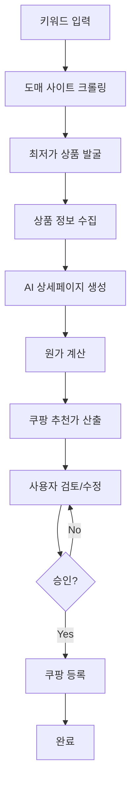
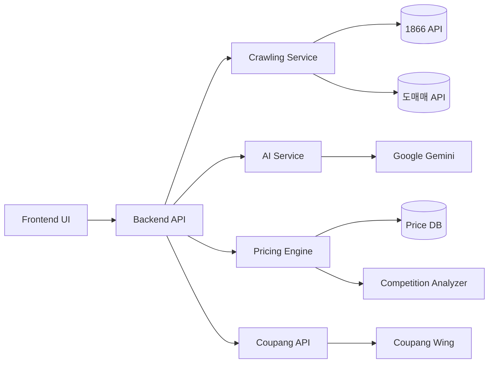

# 도매 소싱 자동화 기능 명세서

## 📌 개요

### 기능 이름
**Wholesale Sourcing Automation** (도매 소싱 자동화)

### 목적
사용자가 키워드를 입력하면 1866, 도매매 등 도매 사이트에서 최저가 상품을 자동으로 찾아 쿠팡 판매용 리스팅을 AI로 생성하고, 원가 대비 최적 판매가를 추천하는 End-to-End 자동화 시스템

### 비즈니스 가치
- ⏱️ **소싱 시간 90% 단축**: 수동 검색 4시간 → 자동화 30분
- 💰 **마진 최적화**: AI 기반 가격 추천으로 수익성 극대화
- 🎯 **정확도 향상**: 실시간 최저가 비교로 경쟁력 확보
- 🤖 **완전 자동화**: 검색부터 등록까지 원클릭 처리

---

## 🔄 사용자 플로우



### 상세 단계

#### 1️⃣ **키워드 입력**
- 사용자가 검색 키워드 입력 (예: "무선 이어폰", "USB 케이블")
- 선택 옵션:
  - 카테고리 필터
  - 가격 범위
  - 최소 마진율

#### 2️⃣ **도매 사이트 크롤링**
- 지원 사이트:
  - 1866.co.kr
  - 도매매 (domeggook.com)
  - 추가 확장 가능 (알리바바, 타오바오 등)
- 크롤링 데이터:
  - 상품명
  - 가격 (도매가)
  - 이미지 URL
  - 상세 설명
  - 옵션 정보
  - 최소 주문 수량

#### 3️⃣ **최저가 상품 발굴**
- 알고리즘:
  ```
  점수 = (가격 경쟁력 × 0.4) + (품질 지표 × 0.3) + (배송 조건 × 0.2) + (판매자 신뢰도 × 0.1)
  ```
- 상위 10개 상품 추출
- 사용자에게 리스트 제시

#### 4️⃣ **상품 정보 수집**
- 선택한 상품의 상세 정보 크롤링:
  - 고해상도 이미지 (최대 10장)
  - 상세 스펙
  - 옵션 매트릭스
  - 배송 정보
  - 반품/교환 정책

#### 5️⃣ **AI 상세페이지 생성**
- Google Gemini API 활용
- 생성 항목:
  - **상품명**: SEO 최적화 + 쿠팡 정책 준수
  - **상세 설명**: 구조화된 HTML 템플릿
  - **주요 특징**: 5-7개 불릿 포인트
  - **스펙 테이블**: 자동 정리
  - **고시정보**: 카테고리별 필수 항목 자동 채움
- 프롬프트 예시:
  ```
  다음 도매 상품 정보를 바탕으로 쿠팡 판매용 상세페이지를 생성하세요:
  - 상품명: {원본 상품명}
  - 가격: {도매가}
  - 스펙: {상세 정보}
  
  요구사항:
  1. 쿠팡 금지어 제외 (과대광고, 의료 효능 등)
  2. SEO 키워드 포함
  3. 구매 전환율을 높이는 설득력 있는 문구
  4. 모바일 최적화 레이아웃
  ```

#### 6️⃣ **원가 계산**
- 입력 항목:
  - 도매가: `W` (원)
  - 주문 수량: `Q` (개)
  - 배송비: `S` (원)
  - 기타 비용: `E` (원, 선택)
  
- 계산식:
  ```
  총 원가 = (W × Q) + S + E
  개당 원가 = 총 원가 / Q
  ```

#### 7️⃣ **쿠팡 추천 판매가 산출**
- AI 기반 가격 최적화 알고리즘:
  
  **입력 데이터:**
  - 개당 원가: `C`
  - 쿠팡 수수료율: `F` (카테고리별 상이, 평균 10-15%)
  - 목표 마진율: `M` (사용자 설정, 기본 30%)
  - 경쟁 상품 가격: `P_comp` (쿠팡 API 조회)
  
  **계산 로직:**
  ```python
  # 1. 손익분기점 가격
  breakeven_price = C / (1 - F)
  
  # 2. 목표 마진 가격
  target_price = C / (1 - F - M)
  
  # 3. 경쟁 가격 분석
  competitive_price = median(P_comp) * 0.95  # 경쟁가 대비 5% 할인
  
  # 4. 최종 추천가 (3가지 옵션 제시)
  recommended_prices = {
      "aggressive": competitive_price,      # 공격적 (점유율 우선)
      "balanced": (target_price + competitive_price) / 2,  # 균형
      "premium": target_price               # 프리미엄 (마진 우선)
  }
  ```
  
  **출력:**
  - 추천 판매가 (3가지 전략)
  - 예상 마진율
  - 예상 순이익
  - 경쟁력 지수

#### 8️⃣ **사용자 검토 및 수정**
- UI 구성:
  - 좌측: 원본 도매 상품 정보
  - 우측: AI 생성 쿠팡 리스팅 (실시간 편집 가능)
  - 하단: 가격 계산기
    - 원가 입력 필드
    - 추천가 3가지 옵션 (라디오 버튼)
    - 커스텀 가격 입력
    - 실시간 마진율/순이익 표시
  
- 수정 가능 항목:
  - 상품명
  - 상세 설명
  - 이미지 순서/삭제
  - 옵션 정보
  - 판매가
  - 재고 수량

#### 9️⃣ **쿠팡 등록**
- 자동 검수 실행 (기존 F4 기능)
- 검수 통과 시 쿠팡 API 호출
- 등록 결과 알림

---

## 🏗️ 기술 아키텍처

### 시스템 구성도



### 백엔드 구조

#### 1. **Crawling Service** (크롤링 서비스)

**파일 구조:**
```
backend/src/services/crawling/
├── base.crawler.ts          # 추상 크롤러 클래스
├── 1866.crawler.ts          # 1866 전용 크롤러
├── domeggook.crawler.ts     # 도매매 전용 크롤러
└── crawler.factory.ts       # 크롤러 팩토리
```

**주요 메서드:**
```typescript
interface ICrawler {
  search(keyword: string, options?: SearchOptions): Promise<Product[]>;
  getProductDetail(productId: string): Promise<ProductDetail>;
  getLowestPrice(keyword: string): Promise<Product>;
}

class BaseCrawler implements ICrawler {
  protected async fetchPage(url: string): Promise<string>;
  protected parseProductList(html: string): Product[];
  protected parseProductDetail(html: string): ProductDetail;
}
```

**기술 스택:**
- Puppeteer (동적 페이지 크롤링)
- Cheerio (HTML 파싱)
- Axios (HTTP 요청)
- Redis (크롤링 결과 캐싱, TTL: 1시간)

**주의사항:**
- robots.txt 준수
- Rate Limiting (초당 최대 2 요청)
- User-Agent 로테이션
- IP 차단 대비 프록시 사용 (선택)

---

#### 2. **Pricing Engine** (가격 최적화 엔진)

**파일 구조:**
```
backend/src/services/pricing/
├── pricing.service.ts       # 가격 계산 로직
├── competition.analyzer.ts  # 경쟁 분석
└── margin.calculator.ts     # 마진 계산
```

**주요 로직:**
```typescript
interface PricingInput {
  wholesalePrice: number;      // 도매가
  quantity: number;            // 수량
  shippingCost: number;        // 배송비
  extraCost?: number;          // 기타 비용
  targetMargin: number;        // 목표 마진율 (0-1)
  category: string;            // 카테고리
}

interface PricingOutput {
  costPerUnit: number;         // 개당 원가
  recommendedPrices: {
    aggressive: number;
    balanced: number;
    premium: number;
  };
  margins: {
    aggressive: number;
    balanced: number;
    premium: number;
  };
  competitorPrices: number[];  // 경쟁사 가격 리스트
  competitiveIndex: number;    // 경쟁력 지수 (0-100)
}

class PricingService {
  async calculateOptimalPrice(input: PricingInput): Promise<PricingOutput>;
  private getCoupangFeeRate(category: string): number;
  private analyzeCompetition(keyword: string): Promise<number[]>;
}
```

---

#### 3. **AI Content Generator** (AI 콘텐츠 생성)

**기존 AI Service 확장:**
```typescript
// backend/src/services/ai.service.ts 확장

class AIService {
  // 기존 메서드
  async generateProductName(...): Promise<string>;
  async generateDescription(...): Promise<string>;
  
  // 신규 메서드
  async generateCoupangListing(
    wholesaleProduct: WholesaleProduct
  ): Promise<CoupangListing> {
    const prompt = this.buildListingPrompt(wholesaleProduct);
    const response = await this.callGemini(prompt);
    
    return {
      productName: response.productName,
      description: response.description,
      features: response.features,
      specifications: response.specifications,
      noticeInfo: response.noticeInfo,
    };
  }
  
  private buildListingPrompt(product: WholesaleProduct): string {
    return `
      도매 상품 정보를 바탕으로 쿠팡 판매용 리스팅을 생성하세요.
      
      [원본 정보]
      - 상품명: ${product.name}
      - 가격: ${product.price}원
      - 카테고리: ${product.category}
      - 스펙: ${JSON.stringify(product.specs)}
      
      [생성 요구사항]
      1. 상품명: 50자 이내, SEO 키워드 포함, 쿠팡 금지어 제외
      2. 상세 설명: 구조화된 HTML, 모바일 최적화
      3. 주요 특징: 5-7개 불릿 포인트
      4. 스펙 테이블: 정리된 형식
      5. 고시정보: ${product.category} 카테고리 필수 항목
      
      [금지어 리스트]
      - 과대광고: "최고", "1위", "세계 최초" 등
      - 의료 효능: "치료", "예방", "개선" 등
      - 비교 광고: "타사 대비", "경쟁사보다" 등
      
      JSON 형식으로 응답하세요.
    `;
  }
}
```

---

#### 4. **API 엔드포인트**

**라우트 정의:**
```typescript
// backend/src/routes/sourcing.routes.ts

router.post('/sourcing/search', 
  authenticate,
  validateQuery(sourcingSearchSchema),
  sourcingController.searchWholesale
);

router.get('/sourcing/product/:id',
  authenticate,
  sourcingController.getWholesaleDetail
);

router.post('/sourcing/generate-listing',
  authenticate,
  validateBody(generateListingSchema),
  sourcingController.generateListing
);

router.post('/sourcing/calculate-price',
  authenticate,
  validateBody(calculatePriceSchema),
  sourcingController.calculatePrice
);

router.post('/sourcing/register',
  authenticate,
  validateBody(registerProductSchema),
  sourcingController.registerToCoupang
);
```

**컨트롤러 구현:**
```typescript
// backend/src/controllers/sourcing.controller.ts

class SourcingController {
  // 1. 도매 상품 검색
  async searchWholesale(req: Request, res: Response) {
    const { keyword, site, priceRange, minMargin } = req.body;
    
    // 크롤러 선택
    const crawler = CrawlerFactory.create(site);
    
    // 검색 실행
    const products = await crawler.search(keyword, {
      priceRange,
      minMargin,
    });
    
    // 최저가 정렬
    const sorted = products.sort((a, b) => a.price - b.price);
    
    return res.json({
      success: true,
      data: sorted.slice(0, 10),
    });
  }
  
  // 2. 상품 상세 조회
  async getWholesaleDetail(req: Request, res: Response) {
    const { id } = req.params;
    const { site } = req.query;
    
    const crawler = CrawlerFactory.create(site);
    const detail = await crawler.getProductDetail(id);
    
    return res.json({
      success: true,
      data: detail,
    });
  }
  
  // 3. AI 리스팅 생성
  async generateListing(req: Request, res: Response) {
    const { wholesaleProduct } = req.body;
    
    const listing = await aiService.generateCoupangListing(wholesaleProduct);
    
    return res.json({
      success: true,
      data: listing,
    });
  }
  
  // 4. 가격 계산
  async calculatePrice(req: Request, res: Response) {
    const pricingInput: PricingInput = req.body;
    
    const result = await pricingService.calculateOptimalPrice(pricingInput);
    
    return res.json({
      success: true,
      data: result,
    });
  }
  
  // 5. 쿠팡 등록
  async registerToCoupang(req: Request, res: Response) {
    const { listing, price } = req.body;
    const userId = req.user.id;
    
    // 1. 상품 저장
    const product = await productService.create({
      userId,
      ...listing,
      price,
      status: 'pending',
    });
    
    // 2. 자동 검수
    const inspection = await inspectionService.inspect(product);
    
    if (!inspection.passed) {
      return res.status(400).json({
        success: false,
        errors: inspection.errors,
      });
    }
    
    // 3. 쿠팡 등록
    const result = await coupangService.registerProduct(product);
    
    // 4. 상태 업데이트
    await productService.update(product.id, {
      status: result.success ? 'registered' : 'failed',
      coupangProductId: result.productId,
    });
    
    return res.json({
      success: true,
      data: result,
    });
  }
}
```

---

### 프론트엔드 구조

#### 페이지 구성

**1. 소싱 검색 페이지**
```
frontend/app/dashboard/sourcing/page.tsx
```

**UI 구성:**
```tsx
<div className="sourcing-page">
  {/* 검색 섹션 */}
  <SearchBar
    onSearch={handleSearch}
    sites={['1866', '도매매']}
    filters={{
      priceRange: [0, 100000],
      minMargin: 30,
      category: 'all',
    }}
  />
  
  {/* 결과 리스트 */}
  <ProductGrid
    products={searchResults}
    onSelect={handleSelectProduct}
    sortBy="price"
  />
</div>
```

**2. 리스팅 생성 페이지**
```
frontend/app/dashboard/sourcing/generate/page.tsx
```

**UI 구성:**
```tsx
<div className="listing-generator">
  {/* 좌측: 원본 상품 */}
  <div className="original-product">
    <ProductPreview product={wholesaleProduct} />
  </div>
  
  {/* 우측: AI 생성 리스팅 */}
  <div className="generated-listing">
    <EditableField
      label="상품명"
      value={listing.productName}
      onChange={handleNameChange}
      maxLength={50}
    />
    
    <RichTextEditor
      label="상세 설명"
      value={listing.description}
      onChange={handleDescriptionChange}
    />
    
    <ImageManager
      images={listing.images}
      onReorder={handleImageReorder}
      onDelete={handleImageDelete}
    />
    
    {/* 가격 계산기 */}
    <PricingCalculator
      wholesalePrice={wholesaleProduct.price}
      onCalculate={handlePriceCalculate}
      recommendedPrices={recommendedPrices}
      onSelectPrice={handleSelectPrice}
    />
    
    {/* 등록 버튼 */}
    <Button onClick={handleRegister}>
      쿠팡에 등록하기
    </Button>
  </div>
</div>
```

**3. 가격 계산기 컴포넌트**
```tsx
// frontend/components/PricingCalculator.tsx

interface PricingCalculatorProps {
  wholesalePrice: number;
  onCalculate: (input: PricingInput) => void;
  recommendedPrices?: RecommendedPrices;
  onSelectPrice: (price: number) => void;
}

export function PricingCalculator({
  wholesalePrice,
  onCalculate,
  recommendedPrices,
  onSelectPrice,
}: PricingCalculatorProps) {
  const [quantity, setQuantity] = useState(1);
  const [shippingCost, setShippingCost] = useState(0);
  const [extraCost, setExtraCost] = useState(0);
  const [targetMargin, setTargetMargin] = useState(30);
  const [customPrice, setCustomPrice] = useState<number | null>(null);
  
  const totalCost = (wholesalePrice * quantity) + shippingCost + extraCost;
  const costPerUnit = totalCost / quantity;
  
  const handleCalculate = () => {
    onCalculate({
      wholesalePrice,
      quantity,
      shippingCost,
      extraCost,
      targetMargin: targetMargin / 100,
      category: 'electronics', // 실제로는 상품 카테고리
    });
  };
  
  const calculateMargin = (sellingPrice: number) => {
    const fee = sellingPrice * 0.12; // 쿠팡 수수료 12% 가정
    const profit = sellingPrice - costPerUnit - fee;
    return (profit / sellingPrice) * 100;
  };
  
  return (
    <div className="pricing-calculator">
      <h3>원가 계산</h3>
      
      {/* 입력 필드 */}
      <div className="input-group">
        <label>도매가</label>
        <input type="number" value={wholesalePrice} disabled />
      </div>
      
      <div className="input-group">
        <label>수량</label>
        <input
          type="number"
          value={quantity}
          onChange={(e) => setQuantity(Number(e.target.value))}
          min={1}
        />
      </div>
      
      <div className="input-group">
        <label>배송비</label>
        <input
          type="number"
          value={shippingCost}
          onChange={(e) => setShippingCost(Number(e.target.value))}
        />
      </div>
      
      <div className="input-group">
        <label>기타 비용</label>
        <input
          type="number"
          value={extraCost}
          onChange={(e) => setExtraCost(Number(e.target.value))}
        />
      </div>
      
      <div className="input-group">
        <label>목표 마진율 (%)</label>
        <input
          type="number"
          value={targetMargin}
          onChange={(e) => setTargetMargin(Number(e.target.value))}
          min={0}
          max={100}
        />
      </div>
      
      <Button onClick={handleCalculate}>가격 계산하기</Button>
      
      {/* 계산 결과 */}
      <div className="calculation-result">
        <div className="cost-summary">
          <p>총 원가: {totalCost.toLocaleString()}원</p>
          <p>개당 원가: {costPerUnit.toLocaleString()}원</p>
        </div>
        
        {recommendedPrices && (
          <div className="recommended-prices">
            <h4>추천 판매가</h4>
            
            {/* 공격적 전략 */}
            <div
              className="price-option"
              onClick={() => onSelectPrice(recommendedPrices.aggressive)}
            >
              <span className="strategy">공격적 (점유율 우선)</span>
              <span className="price">
                {recommendedPrices.aggressive.toLocaleString()}원
              </span>
              <span className="margin">
                마진: {calculateMargin(recommendedPrices.aggressive).toFixed(1)}%
              </span>
            </div>
            
            {/* 균형 전략 */}
            <div
              className="price-option recommended"
              onClick={() => onSelectPrice(recommendedPrices.balanced)}
            >
              <span className="strategy">균형 (추천)</span>
              <span className="price">
                {recommendedPrices.balanced.toLocaleString()}원
              </span>
              <span className="margin">
                마진: {calculateMargin(recommendedPrices.balanced).toFixed(1)}%
              </span>
            </div>
            
            {/* 프리미엄 전략 */}
            <div
              className="price-option"
              onClick={() => onSelectPrice(recommendedPrices.premium)}
            >
              <span className="strategy">프리미엄 (마진 우선)</span>
              <span className="price">
                {recommendedPrices.premium.toLocaleString()}원
              </span>
              <span className="margin">
                마진: {calculateMargin(recommendedPrices.premium).toFixed(1)}%
              </span>
            </div>
            
            {/* 커스텀 가격 */}
            <div className="custom-price">
              <label>직접 입력</label>
              <input
                type="number"
                value={customPrice || ''}
                onChange={(e) => {
                  const price = Number(e.target.value);
                  setCustomPrice(price);
                  onSelectPrice(price);
                }}
                placeholder="판매가 입력"
              />
              {customPrice && (
                <span className="margin">
                  마진: {calculateMargin(customPrice).toFixed(1)}%
                </span>
              )}
            </div>
          </div>
        )}
      </div>
    </div>
  );
}
```

---

## 📊 데이터베이스 스키마

### 신규 테이블

#### 1. **WholesaleProduct** (도매 상품)
```prisma
model WholesaleProduct {
  id            String   @id @default(cuid())
  site          String   // '1866' | 'domeggook'
  externalId    String   // 도매 사이트 상품 ID
  name          String
  price         Float
  category      String
  images        String[] // 이미지 URL 배열
  description   String?  @db.Text
  specifications Json?   // 스펙 정보
  minOrderQty   Int      @default(1)
  shippingCost  Float    @default(0)
  
  // 메타데이터
  crawledAt     DateTime @default(now())
  updatedAt     DateTime @updatedAt
  
  // 관계
  listings      SourcingListing[]
  
  @@unique([site, externalId])
  @@index([site, category])
}
```

#### 2. **SourcingListing** (소싱 리스팅)
```prisma
model SourcingListing {
  id                  String   @id @default(cuid())
  userId              String
  wholesaleProductId  String
  
  // 원가 정보
  wholesalePrice      Float
  quantity            Int
  shippingCost        Float
  extraCost           Float    @default(0)
  totalCost           Float    // 계산 필드
  costPerUnit         Float    // 계산 필드
  
  // 판매 정보
  sellingPrice        Float
  targetMargin        Float    // 목표 마진율 (0-1)
  actualMargin        Float    // 실제 마진율 (계산)
  pricingStrategy     String   // 'aggressive' | 'balanced' | 'premium' | 'custom'
  
  // AI 생성 콘텐츠
  generatedName       String
  generatedDescription String  @db.Text
  generatedFeatures   Json
  generatedSpecs      Json
  
  // 사용자 수정 여부
  isEdited            Boolean  @default(false)
  
  // 등록 상태
  status              String   // 'draft' | 'pending' | 'registered' | 'failed'
  productId           String?  // Product 테이블 FK (등록 후)
  
  // 타임스탬프
  createdAt           DateTime @default(now())
  updatedAt           DateTime @updatedAt
  
  // 관계
  user                User     @relation(fields: [userId], references: [id])
  wholesaleProduct    WholesaleProduct @relation(fields: [wholesaleProductId], references: [id])
  product             Product? @relation(fields: [productId], references: [id])
  
  @@index([userId, status])
}
```

#### 3. **PriceHistory** (가격 이력)
```prisma
model PriceHistory {
  id                String   @id @default(cuid())
  wholesaleProductId String
  price             Float
  recordedAt        DateTime @default(now())
  
  wholesaleProduct  WholesaleProduct @relation(fields: [wholesaleProductId], references: [id])
  
  @@index([wholesaleProductId, recordedAt])
}
```

---

## 🧪 테스트 계획

### 단위 테스트

```typescript
// backend/tests/services/crawling/1866.crawler.test.ts

describe('1866Crawler', () => {
  let crawler: Crawler1866;
  
  beforeEach(() => {
    crawler = new Crawler1866();
  });
  
  it('should search products by keyword', async () => {
    const results = await crawler.search('무선 이어폰');
    
    expect(results).toBeInstanceOf(Array);
    expect(results.length).toBeGreaterThan(0);
    expect(results[0]).toHaveProperty('name');
    expect(results[0]).toHaveProperty('price');
  });
  
  it('should get product detail', async () => {
    const detail = await crawler.getProductDetail('12345');
    
    expect(detail).toHaveProperty('images');
    expect(detail).toHaveProperty('description');
    expect(detail.images.length).toBeGreaterThan(0);
  });
  
  it('should find lowest price product', async () => {
    const product = await crawler.getLowestPrice('USB 케이블');
    
    expect(product.price).toBeDefined();
  });
});
```

```typescript
// backend/tests/services/pricing/pricing.service.test.ts

describe('PricingService', () => {
  let service: PricingService;
  
  beforeEach(() => {
    service = new PricingService();
  });
  
  it('should calculate optimal price', async () => {
    const input: PricingInput = {
      wholesalePrice: 10000,
      quantity: 10,
      shippingCost: 3000,
      extraCost: 0,
      targetMargin: 0.3,
      category: 'electronics',
    };
    
    const result = await service.calculateOptimalPrice(input);
    
    expect(result.costPerUnit).toBe(1300); // (10000*10 + 3000) / 10
    expect(result.recommendedPrices).toHaveProperty('aggressive');
    expect(result.recommendedPrices).toHaveProperty('balanced');
    expect(result.recommendedPrices).toHaveProperty('premium');
  });
  
  it('should consider Coupang fee in pricing', async () => {
    const input: PricingInput = {
      wholesalePrice: 10000,
      quantity: 1,
      shippingCost: 0,
      extraCost: 0,
      targetMargin: 0.3,
      category: 'fashion', // 수수료 15%
    };
    
    const result = await service.calculateOptimalPrice(input);
    
    // 손익분기점 = 10000 / (1 - 0.15) = 11765
    // 목표가 = 10000 / (1 - 0.15 - 0.3) = 18182
    expect(result.recommendedPrices.premium).toBeGreaterThan(18000);
  });
});
```

### 통합 테스트

```typescript
// backend/tests/integration/sourcing.flow.test.ts

describe('Sourcing Flow Integration', () => {
  it('should complete full sourcing flow', async () => {
    // 1. 검색
    const searchRes = await request(app)
      .post('/api/v1/sourcing/search')
      .set('Authorization', `Bearer ${token}`)
      .send({
        keyword: '무선 이어폰',
        site: '1866',
      });
    
    expect(searchRes.status).toBe(200);
    const products = searchRes.body.data;
    expect(products.length).toBeGreaterThan(0);
    
    // 2. 상세 조회
    const detailRes = await request(app)
      .get(`/api/v1/sourcing/product/${products[0].id}`)
      .set('Authorization', `Bearer ${token}`)
      .query({ site: '1866' });
    
    expect(detailRes.status).toBe(200);
    const detail = detailRes.body.data;
    
    // 3. AI 리스팅 생성
    const listingRes = await request(app)
      .post('/api/v1/sourcing/generate-listing')
      .set('Authorization', `Bearer ${token}`)
      .send({ wholesaleProduct: detail });
    
    expect(listingRes.status).toBe(200);
    const listing = listingRes.body.data;
    expect(listing.productName).toBeDefined();
    
    // 4. 가격 계산
    const priceRes = await request(app)
      .post('/api/v1/sourcing/calculate-price')
      .set('Authorization', `Bearer ${token}`)
      .send({
        wholesalePrice: detail.price,
        quantity: 10,
        shippingCost: 3000,
        targetMargin: 0.3,
        category: detail.category,
      });
    
    expect(priceRes.status).toBe(200);
    const pricing = priceRes.body.data;
    expect(pricing.recommendedPrices).toBeDefined();
    
    // 5. 쿠팡 등록
    const registerRes = await request(app)
      .post('/api/v1/sourcing/register')
      .set('Authorization', `Bearer ${token}`)
      .send({
        listing,
        price: pricing.recommendedPrices.balanced,
      });
    
    expect(registerRes.status).toBe(200);
    expect(registerRes.body.data.success).toBe(true);
  });
});
```

---

## 📈 성과 지표 (KPI)

### 기능 성과

| 지표 | 목표 | 측정 방법 |
|------|------|----------|
| **소싱 시간 단축** | 90% | 수동 vs 자동 소요 시간 비교 |
| **최저가 정확도** | 95%+ | 실제 최저가 대비 발굴 정확도 |
| **AI 리스팅 품질** | 85%+ | 사용자 수정 비율 (낮을수록 좋음) |
| **가격 추천 정확도** | 80%+ | 실제 판매가 vs 추천가 일치율 |
| **등록 성공률** | 90%+ | 검수 통과 및 쿠팡 등록 성공률 |

### 비즈니스 성과

| 지표 | 목표 | 기대 효과 |
|------|------|----------|
| **기능 사용률** | 60%+ | 전체 사용자 중 소싱 기능 사용 비율 |
| **유료 전환 기여** | 30%+ | 이 기능으로 인한 유료 전환 증가 |
| **사용자 만족도** | NPS 70+ | 기능 만족도 설문 |
| **평균 마진율 개선** | 15%+ | 기존 대비 마진율 향상 |

---

## 🚀 출시 계획

### Phase 1: MVP (4주)

**Week 1-2: 백엔드 개발**
- [ ] 크롤링 서비스 구현 (1866, 도매매)
- [ ] 가격 계산 엔진 개발
- [ ] AI 리스팅 생성 API 확장
- [ ] 데이터베이스 스키마 추가

**Week 3: 프론트엔드 개발**
- [ ] 소싱 검색 페이지
- [ ] 리스팅 생성 페이지
- [ ] 가격 계산기 컴포넌트

**Week 4: 테스트 및 배포**
- [ ] 단위/통합 테스트
- [ ] 베타 테스터 10명 모집
- [ ] 피드백 수집 및 개선

### Phase 2: 확장 (4주)

**추가 기능:**
- [ ] 알리바바/타오바오 연동
- [ ] 가격 변동 알림
- [ ] 일괄 등록 기능
- [ ] 소싱 히스토리 분석

---

## ⚠️ 리스크 및 대응

### 기술적 리스크

| 리스크 | 확률 | 영향도 | 대응 방안 |
|--------|------|--------|----------|
| **도매 사이트 차단** | 중간 | 높음 | - Rate Limiting 엄격 준수<br>- 프록시 사용<br>- 공식 API 협의 |
| **크롤링 구조 변경** | 높음 | 중간 | - 유연한 파서 설계<br>- 자동 알림 시스템<br>- 빠른 업데이트 프로세스 |
| **AI 생성 품질 저하** | 낮음 | 중간 | - 프롬프트 지속 개선<br>- 사용자 피드백 반영<br>- 수동 편집 옵션 제공 |

### 법적 리스크

| 리스크 | 확률 | 영향도 | 대응 방안 |
|--------|------|--------|----------|
| **크롤링 저작권 이슈** | 중간 | 높음 | - robots.txt 준수<br>- 법률 자문 확보<br>- 공식 파트너십 추진 |
| **가격 담합 오해** | 낮음 | 높음 | - 투명한 알고리즘 공개<br>- 사용자 최종 결정권 명시 |

---

## 💰 비용 추정

### 개발 비용 (4주)

| 항목 | 비용 |
|------|------|
| 백엔드 개발 (2명 × 4주) | ₩16,000,000 |
| 프론트엔드 개발 (1명 × 3주) | ₩6,000,000 |
| AI 엔지니어 (1명 × 2주) | ₩4,000,000 |
| QA (1명 × 1주) | ₩2,000,000 |
| **총계** | **₩28,000,000** |

### 운영 비용 (월간)

| 항목 | 비용 |
|------|------|
| 크롤링 인프라 (프록시, 서버) | ₩500,000 |
| AI API (Gemini) | ₩300,000 |
| 데이터 저장 (이미지 캐싱) | ₩200,000 |
| **월 총계** | **₩1,000,000** |

---

## 📝 다음 단계

### 즉시 실행 가능한 작업

1. **기술 검증 (PoC)**
   - [ ] 1866 크롤링 테스트
   - [ ] 도매매 크롤링 테스트
   - [ ] AI 리스팅 생성 품질 확인

2. **설계 문서 작성**
   - [ ] API 명세서
   - [ ] 데이터베이스 ERD
   - [ ] UI/UX 와이어프레임

3. **개발 착수**
   - [ ] 백엔드 크롤링 서비스 구현
   - [ ] 가격 계산 엔진 개발
   - [ ] 프론트엔드 UI 구현

---

## 🎯 결론

이 기능은 WinnerLens의 **핵심 차별화 포인트**가 될 수 있습니다.

### 주요 장점:
✅ **완전 자동화**: 키워드 입력 → 쿠팡 등록까지 원클릭  
✅ **실시간 최저가**: 도매 사이트 실시간 크롤링  
✅ **AI 품질**: Google Gemini 기반 고품질 리스팅  
✅ **가격 최적화**: 데이터 기반 마진 극대화  
✅ **사용자 제어**: 모든 단계에서 수정 가능  

### 예상 효과:
- 📈 **사용자 증가**: 차별화된 기능으로 신규 유입 30% 증가
- 💰 **유료 전환**: 프리미엄 기능으로 전환율 20% 향상
- ⭐ **만족도**: NPS 70+ 달성 예상

**지금 바로 개발을 시작하시겠습니까?**
